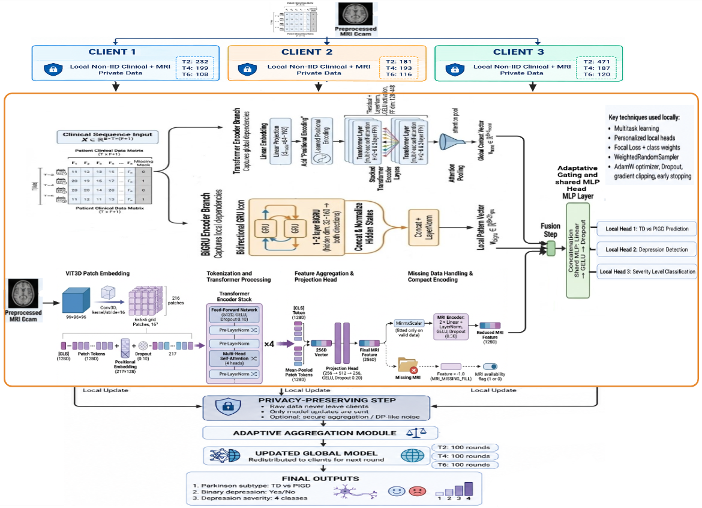
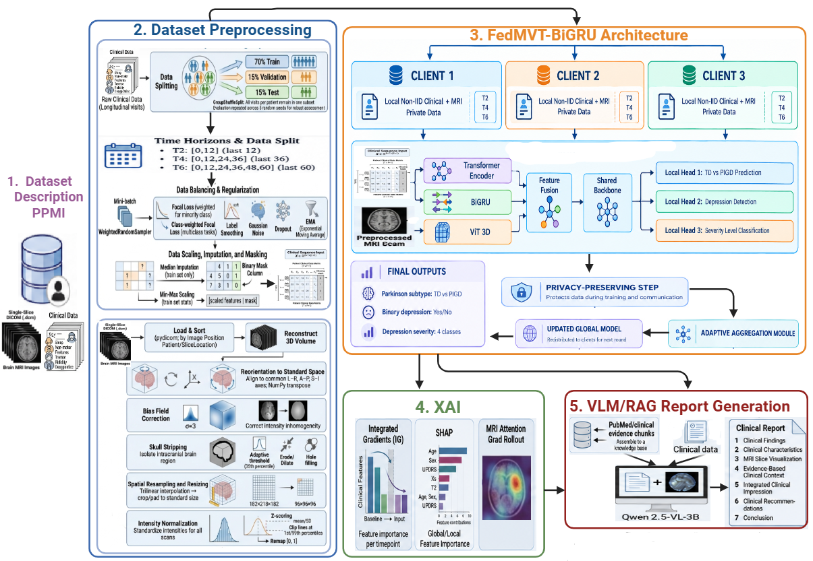
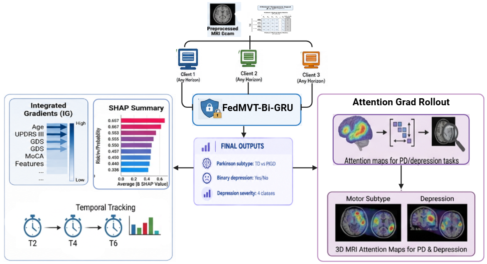
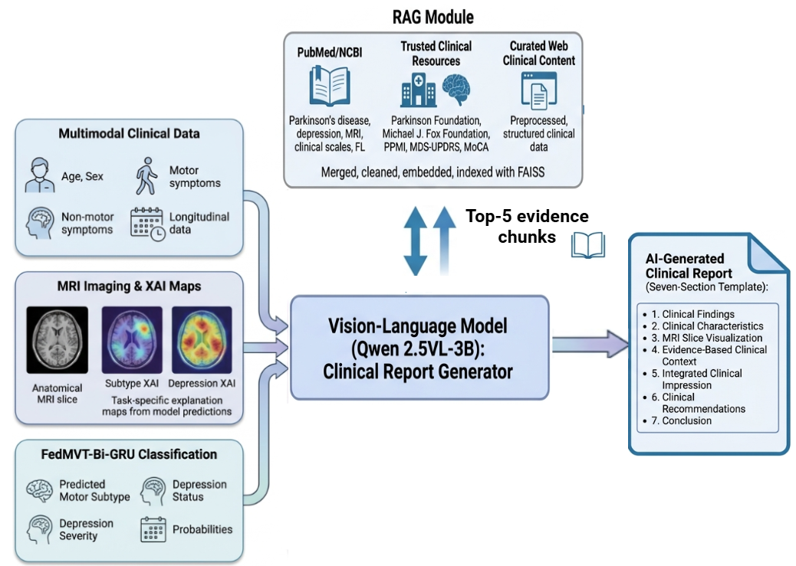

# PD-MultiFed-X

### A Privacy-Preserving Multimodal Federated Learning Framework for Parkinson's Disease and Depression

PD-MultiFed-X is a multimodal longitudinal framework for the joint analysis of **Parkinson's disease motor subtypes, depression, and depression severity**. It integrates longitudinal clinical assessments, 3D MRI representations, parallel temporal and spatial encoders, multitask learning, federated learning, explainable AI, and structured clinical report generation.

---

## Repository Structure

```text
PD-MultiFed-X/
├── README.md
├── LICENSE
├── requirements.txt
├── .gitignore
├── .env.example
│
├── notebooks/
│   ├── 01_vit3d_extraction.ipynb
│   ├── 02_depression.ipynb
│   ├── 03_severity.ipynb
│   ├── 04_subtype.ipynb
│   ├── 05_multitask.ipynb
│   ├── 06_federated_learning.ipynb
│   ├── 07_explainability.ipynb
│   └── 08_vlm_report_generation.ipynb
│
├── rag/
│   └── parkinson-rag-professional-faiss-enriched/
│       ├── chunks.csv
│       ├── pubmed_abstracts.csv
│       └── web_sources.csv
│
├── docs/                                    # architecture diagrams used in this README
│   ├── architecture_diagram.png
│   ├── federated_architecture.png
│   ├── xai_architecture.png
│   └── vlm_rag_architecture.png
│
└── configs/          # model / training configuration files
```

Participant-level clinical and imaging data (PPMI) are **not** included in this repository — see [Data Availability](#data-availability).

---

## Installation

```bash
git clone https://github.com/<your-username>/PD-MultiFed-X.git
cd PD-MultiFed-X
python -m venv venv
source venv/bin/activate        # Windows: venv\Scripts\activate
pip install -r requirements.txt
```

### Environment variables

The VLM report-generation notebook needs a Hugging Face access token to download `Qwen2.5-VL-3B-Instruct`.

```bash
cp .env.example .env
# then edit .env and set your own token:
# HF_TOKEN=hf_xxxxxxxxxxxxxxxxxxxx
```

Never commit your real `.env` file or paste a token directly into a notebook cell.

---

## Quickstart / Recommended Run Order

1. `notebooks/01_vit3d_extraction.ipynb` — trains ViT3D and extracts `mri_features.csv`
2. `notebooks/02_depression.ipynb`, `03_severity.ipynb`, `04_subtype.ipynb` — single-task baselines
3. `notebooks/05_multitask.ipynb` — joint multitask model
4. `notebooks/06_federated_learning.ipynb` — federated training across simulated clients
5. `notebooks/07_explainability.ipynb` — SHAP / Integrated Gradients / Attention Grad Rollout on the trained global model
6. `notebooks/08_vlm_report_generation.ipynb` — structured clinical report generation with Qwen2.5-VL-3B-Instruct + RAG

Each notebook currently contains hardcoded input/output paths from the original Kaggle/Colab development environment (e.g. `/kaggle/working/...`, `/content/drive/...`). Update the path variables near the top of each notebook to point to your own local data and output directories before running.

---

## Input Data

The framework uses longitudinal clinical assessments together with 3D MRI data (DICOM format).

### Clinical Data

The main clinical files used throughout the experiments are:

| File                             | Information                                |
| -------------------------------- | ------------------------------------------ |
| `Demographics.csv`               | Demographic information                    |
| `Participant_Status.csv`         | Participant diagnostic/status information  |
| `Geriatric_Depression_Scale.csv` | Depression assessment and GDS scores       |
| `Epworth_Sleepiness_Scale.csv`   | Sleepiness-related assessment              |
| `REM_Sleep_Behavior.csv`         | REM sleep behavior assessment              |
| `SCOPA-AUT.csv`                  | Autonomic dysfunction assessment           |
| `MDS-UPDRS_Part_I.csv`           | Non-motor and clinical assessment          |
| `MDS-UPDRS_Part_IV.csv`          | Motor complication assessment              |
| `UPDRS_PartII_PartIII.xlsx`      | Motor examination and activity information |

Clinical records are aligned using:

```text
PATNO + EVENT_ID
```

Visit identifiers are converted into longitudinal study months:

```text
BL → 0 months
Vn → (n − 2) × 6 months
```

The resulting patient-level sequences are used to construct the three longitudinal horizons:

| Horizon | Time points                  |
| ------- | ----------------------------- |
| **T2**  | 0, 12 months                  |
| **T4**  | 0, 12, 24, 36 months          |
| **T6**  | 0, 12, 24, 36, 48, 60 months  |

When multiple records correspond to the same patient and study month, the latest available visit is retained according to the preprocessing procedure.

---

## Classification Tasks

PD-MultiFed-X addresses three complementary classification problems.

### 1. Parkinson's Disease Motor Subtype Classification

A binary classification task distinguishes:

```text
TD   → Tremor-Dominant
PIGD → Postural Instability/Gait Difficulty
```

The subtype label is derived from the relevant motor information according to the study protocol.

The documented classification rule uses the motor ratio:

```text
ratio ≥ 1.5  → TD
ratio ≤ 1.0  → PIGD
```

The resulting labels are encoded for model training as:

```text
TD   → 0
PIGD → 1
```

The subtype experiments (`notebooks/04_subtype.ipynb`) use:

```text
Demographics.csv
MDS-UPDRS_Part_I.csv
UPDRS_PartII_PartIII.xlsx
MDS-UPDRS_Part_IV.csv
MRI features
```

---

### 2. Depression Detection

Depression is formulated as a binary classification problem:

```text
No Depression
Depression
```

The target is derived from the **Geriatric Depression Scale (GDS)**.

The study uses:

```text
GDS < 5  → No Depression
GDS ≥ 5  → Depression
```

The depression experiments (`notebooks/02_depression.ipynb`) use the following selected clinical assessments:

```text
Geriatric_Depression_Scale.csv
Epworth_Sleepiness_Scale.csv
Demographics.csv
SCOPA-AUT.csv
REM_Sleep_Behavior.csv
MDS-UPDRS_Part_I.csv
```

together with the pre-extracted MRI representation `mri_features.csv`.

> **Note:** older notebook versions referred to this file as `mri_featuress.csv` (typo). Standardize on `mri_features.csv` throughout the pipeline.

---

### 3. Depression Severity Classification

Depression severity is formulated as a **four-class classification problem** based on GDS scores:

| GDS Score | Class    | Encoding |
| --------: | -------- | -------: |
|       0–4 | None     |        0 |
|       5–8 | Mild     |        1 |
|      9–11 | Moderate |        2 |
|       ≥12 | Severe   |        3 |

The severity experiment (`notebooks/03_severity.ipynb`) uses:

```text
Geriatric_Depression_Scale.csv
Epworth_Sleepiness_Scale.csv
Demographics.csv
SCOPA-AUT.csv
REM_Sleep_Behavior.csv
MDS-UPDRS_Part_I.csv
mri_features.csv
```

The same T2, T4, and T6 longitudinal horizons are evaluated.

---

## MRI Input and ViT3D

MRI is processed independently from the longitudinal clinical branches, from DICOM series, using `notebooks/01_vit3d_extraction.ipynb`.

The MRI branch uses a **3D Vision Transformer (ViT3D)** to extract a compact representation from volumetric MRI data.

### MRI processing

```text
3D MRI volume (DICOM)
      ↓
3D patch embedding
      ↓
ViT3D encoder
      ↓
256-dimensional MRI representation
```

The documented ViT3D configuration includes:

```text
Volume size       : 96 × 96 × 96
Patch size        : 16 × 16 × 16
Embedding size    : 128
Transformer depth : 4
Attention heads   : 4
Output dimension  : 256
Batch size        : 1
Learning rate     : 1e-4
Weight decay      : 1e-4
```

See `configs/vit3d_config.yaml` for the same parameters in machine-readable form.

### Main generated files

```text
vit3d_multitask_trained_seed42.pt
vit3d_extractor_trained_seed42.pt
mri_features.csv
mri_features_seed42_for_fed_and_xai.csv
vit3d_test_metrics.csv
```

> Trained model checkpoints (`.pt`) are not committed to this repository (see `.gitignore`) due to size. Host them separately (e.g. Hugging Face Hub, Zenodo, institutional storage) and link them here once available.

---

## Parallel Multimodal Architecture

The three representation-learning models operate **in parallel**:



```text
                 LONGITUDINAL CLINICAL DATA
                         │
              ┌──────────┴──────────┐
              │                     │
              ▼                     ▼
       ┌──────────────┐      ┌──────────────┐
       │ Transformer  │      │    BiGRU     │
       │              │      │              │
       │ Global       │      │ Local        │
       │ temporal     │      │ sequential   │
       │ features     │      │ features     │
       └──────┬───────┘      └──────┬───────┘
              │                     │
              │                     │
              │      3D MRI         │
              │        │            │
              │        ▼            │
              │   ┌──────────┐      │
              │   │  ViT3D   │      │
              │   │ MRI      │      │
              │   │ features │      │
              │   └────┬─────┘      │
              │        │            │
              └────────┼────────────┘
                       ▼
             ┌─────────────────────┐
             │ Multimodal Fusion   │
             └──────────┬──────────┘
                        ▼
             ┌─────────────────────┐
             │   Multitask Heads   │
             ├─────────────────────┤
             │ PD Subtype          │
             │ Depression          │
             │ Depression Severity │
             └─────────────────────┘
```

The **Transformer and BiGRU both process longitudinal clinical sequences independently**, while **ViT3D processes MRI volumes independently**. Their representations are fused only after the three branches have produced their respective features.

---

## Single-Task Experiments

The single-task experiments establish independent baselines for each prediction problem.

| Task                 | Notebook                          | Input                                                          | Output                                          |
| -------------------- | ---------------------------------- | --------------------------------------------------------------- | ------------------------------------------------ |
| Depression            | `notebooks/02_depression.ipynb`   | selected depression-related clinical assessments + MRI features | binary depression predictions + metrics          |
| Depression Severity   | `notebooks/03_severity.ipynb`     | selected depression-related clinical assessments + MRI features | four-class severity predictions + metrics        |
| PD Subtype            | `notebooks/04_subtype.ipynb`      | demographic and MDS-UPDRS motor assessments + MRI features      | TD/PIGD predictions + metrics                    |

The documented single-task experiments evaluate the three longitudinal horizons and use multiple random seeds, including **42–46**.

---

## Multitask Learning

`notebooks/05_multitask.ipynb` combines the three classification objectives in a single model.

The fused representation is simultaneously used to predict:

```text
Task 1 → PD motor subtype
Task 2 → Depression status
Task 3 → Depression severity
```

This formulation allows the model to learn shared representations from complementary clinical and imaging information while preserving task-specific prediction heads.

---

## Federated Learning

`notebooks/06_federated_learning.ipynb` evaluates the multimodal multitask model in a federated setting, implemented as a custom local-training / aggregation loop.



```text
Local client training
        ↓
Local model updates
        ↓
Global aggregation
        ↓
Updated global model
        ↓
Repeated communication rounds
```

The main final experiment evaluates T2, T4, and T6 using the multi-seed configuration.

### Main outputs

```text
FINAL_METRICS_ALL_HORIZONS.csv
FINAL_PER_CLASS_TABLE_T2_T4_T6.csv
FINAL_PUBLICATION_TABLE_T2_T4_T6_SEEDS42_46.csv
FINAL_ALL_HORIZONS_ALL_SEEDS_SUMMARY.json
all_test_predictions.csv
global_model_all_in_one.pt
global_model_complete.pt
global_model_state_dict.pt
```

These metric files (CSV/JSON) are generated locally when you run the notebook; the `.pt` checkpoints are excluded from version control (see `.gitignore`).

---

## Explainable AI

`notebooks/07_explainability.ipynb` operates on the trained global/federated model.



### Clinical explanations

```text
SHAP
Integrated Gradients
```

These methods identify influential clinical variables for the different prediction tasks and help analyze the clinical relationships represented by the model.

### MRI explanations

```text
Attention Grad Rollout
```

This method provides attention-based visualization of relevant regions in the MRI representation.

### Main outputs

```text
mri.png
xai_subtype.png
xai_depression.png
xai_patient_details.json
INTERFACE_XAI_PATIENT_DETAILS*.json
ALL_PATIENTS_ATTENTION_GRAD_ROLLOUT_summary*.csv
ALL_PATIENTS_ATTENTION_GRAD_ROLLOUT_summary*.json
```

---

## VLM Clinical Report Generation

`notebooks/08_vlm_report_generation.ipynb` uses **Qwen2.5-VL-3B-Instruct** to generate structured patient reports from the outputs of the predictive and explainability stages. Requires an `HF_TOKEN` set as an environment variable (see [Installation](#installation)).



### Main inputs

```text
Global/federated predictions
Longitudinal patient information
XAI visualizations
XAI JSON outputs
MRI information
Retrieved RAG context
```

### RAG resources

```text
rag/parkinson-rag-professional-faiss-enriched/
├── chunks.csv                          # used by notebooks/08 to build retrieval context
├── pubmed_abstracts.csv                # used by notebooks/08
├── web_sources.csv                     # used by notebooks/08
├── faiss_index/
│   ├── parkinson_faiss.index           # precomputed FAISS index (not re-read by notebooks/08 as-is)
│   ├── chunks_metadata.pkl
│   └── embedding_model_name.txt
└── manual_guidelines/
    ├── clinical_scores_definitions.txt
    ├── combined_manual_guidelines.txt
    ├── mri_features_explanation.txt
    ├── report_generation_rules.txt
    ├── td_pigd_definitions.txt
    ├── xai_guidelines.txt
    └── added_manifest.json
```

> `notebooks/08_vlm_report_generation.ipynb` currently reads directly from the three CSV files (`chunks.csv`, `pubmed_abstracts.csv`, `web_sources.csv`). The `faiss_index/` and `manual_guidelines/` subfolders are additional knowledge-base assets included for completeness/future use but are not yet wired into that notebook's retrieval step.

### Report sections

```text
Patient Overview
Timepoint Summaries
Longitudinal Analysis
Clinical Interpretation
Conclusion
```

The VLM component acts as a **structured report-generation layer** using predefined information and retrieved knowledge rather than as an autonomous clinical decision-making system.

---

## Reproducibility

Experiments are conducted across the following longitudinal horizons:

```text
T2 → 0–12 months
T4 → 0–36 months
T6 → 0–60 months
```

Multi-seed experiments use:

```text
42, 43, 44, 45, 46
```

The notebooks contain the preprocessing, model configuration, training, evaluation, and result-generation procedures required for reproducing the corresponding experiments.

---

## Data Availability

The underlying clinical and imaging data originate from the **Parkinson's Progression Markers Initiative (PPMI)**.

Participant-level PPMI data are not included in this repository. Researchers wishing to reproduce the experiments must obtain the appropriate access independently and comply with the applicable PPMI data-use requirements.

The repository provides the computational implementation and experiment documentation without redistributing restricted participant-level data.

> **Note:** the PPMI database is updated on an ongoing basis (new participants, additional visits, revised/corrected records). The clinical files listed above (`Demographics.csv`, `Geriatric_Depression_Scale.csv`, etc.) therefore reflect a snapshot taken at the time of download and will not exactly match a fresh export from PPMI at a later date. Researchers reproducing these experiments should re-download the current data directly from www.ppmi-info.org/data rather than assuming the dataset is static, and should note the download date for reproducibility.

---

## Research Outputs

The repository supports generation of:

* single-task classification results;
* multitask classification results;
* longitudinal horizon comparisons;
* federated global-model results;
* confusion matrices;
* convergence and loss curves;
* clinical feature explanations;
* MRI attention visualizations;
* structured clinical reports.

---

## Acknowledgements

Data used in the preparation of this article were obtained from the Parkinson's Progression Markers Initiative (PPMI) database (www.ppmi-info.org/data). For up-to-date information on the study, visit www.ppmi-info.org.

PPMI – a public-private partnership – is funded by the Michael J. Fox Foundation for Parkinson's Research and funding partners, including AbbVie, Alamar Biosciences, Aligning Science Across Parkinson's (ASAP), Arrowhead Pharma, Arvinas, AskBio, BIAL, BioArctic, Biohaven, BlueRock Therapeutics, Bristol Myers Squibb, Calico Labs, Capsida Biotherapeutics, Critical Path Institute, DaCapo Brainscience, Denali, Edmond J. Safra Foundation, Eli Lilly, Gain Therapeutics, GE Healthcare, Genentech, GSK, Insitro, Johnson & Johnson Innovative Medicine, Lundbeck, Merck, Neumora, Neuron23, Novartis, Olink, Regeneron, Roche, Sanofi, Tenvie, UCB, Vanqua Bio, Voyager Therapeutics, The Weston Family Foundation.

*(List per PPMI's official "Study Sponsor & Funding Partners" document, May 2026 — reverify at www.ppmi-info.org/about-ppmi/who-we-are/study-sponsors before final submission.)*
